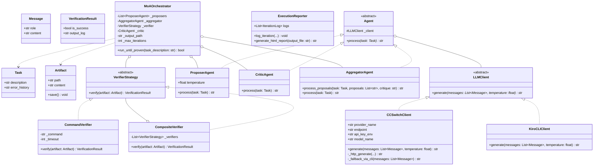

# 🚀 MoA Engine with CC Switch & Deterministic Verification

[](https://github.com/NickScherbakov/moa-cc-switch/actions/workflows/ci.yml)
[](https://www.python.org/downloads/)
[](#-архитектурные-принципы-solid)
[](LICENSE)

Автономный фреймворк оркестрации **Mixture-of-Agents (MoA)**, построенный на принципах чистого ООП и SOLID. Проект объединяет сильные стороны разных моделей LLM (Anthropic Claude, OpenAI GPT, DeepSeek, Ollama) в единый синергический коллектив с автоматической маршрутизацией через **CC Switch** и **доказуемой (детерминированной) верификацией** результатов.

---

## 🤖 Поддерживаемые провайдеры

| Ключ провайдера | Клиент | Способ вызова |
|---|---|---|
| `anthropic`, `ccswitch` | `CCSwitchClient` | HTTP + fallback CLI |
| `openai` | `OpenAIClient` | HTTP |
| `deepseek` | `DeepSeekClient` | HTTP |
| `ollama` | `OllamaClient` | HTTP (localhost) |
| `claude`, `claude-cli` | `ClaudeCLIClient` | `claude --print` |
| `copilot`, `copilot-cli` | `CopilotCLIClient` | `copilot -p ... --yolo` |
| `codex`, `codex-cli` | `CodexCLIClient` | `codex exec` |
| `gemini`, `gemini-cli` | `GeminiCLIClient` | `gemini -p` |
| `antigravity`, `agy` | `AntigravityCLIClient` | `agy -p ... --dangerously-skip-permissions` |
| **`kiro`, `kiro-cli`** | **`KiroCLIClient`** | **`kiro --print` / `-p` / stdin** |

---

## 🆕 Kiro CLI Integration

В состав провайдеров добавлен **`KiroCLIClient`** — интеграция с локально установленным [Kiro CLI](https://kiro.dev).

Клиент реализует трёхшаговую fallback-стратегию:

```
kiro --print "<prompt>"   →   kiro -p "<prompt>"   →   kiro (stdin pipe)
```

- Таймаут каждого шага — 45 секунд (`asyncio.wait_for`)
- При недоступности бинарника или ошибке возвращает строку `"# Kiro CLI error: ..."` — пайплайн не падает
- Диагностика пишется в `sys.stderr`, не засоряя stdout
- Новых зависимостей не добавляется — используются только `asyncio`, `subprocess`, `sys`

### Использование в пресете

```json
{
  "proposers": [
    { "provider": "kiro", "model": "default" },
    { "provider": "claude", "model": "default" }
  ],
  "aggregator": { "provider": "kiro-cli", "model": "default" }
}
```

### Использование в коде

```python
from moa_engine.clients import KiroCLIClient
from moa_engine.domain import Message

client = KiroCLIClient()
response = await client.generate([Message(role="user", content="Write a Python function")])
```

---

## 📐 Диаграмма классов (Class Diagram)



---

## 🏛 Архитектурные принципы (SOLID)

- **Single Responsibility (SRP)**: `CCSwitchClient` отвечает за HTTP-транспорт и ретраи, `Agent` — за роли и промпты, `VerifierStrategy` — за проверку артефактов, `ExecutionReporter` — за HTML-отчёты, `MoAOrchestrator` — за основной цикл.
- **Open/Closed (OCP)**: Добавление новых способов верификации (`CompositeVerifier`) или провайдеров происходит через реализацию абстрактных классов без модификации оркестратора.
- **Liskov Substitution (LSP)**: Любая реализация `LLMClient` или `VerifierStrategy` полностью взаимозаменяема.
- **Interface Segregation (ISP)**: Разделение узких дата-классов `Message`, `Task`, `Artifact`, `VerificationResult`.
- **Dependency Inversion (DIP)**: `MoAOrchestrator` зависит строго от интерфейсов `LLMClient`, `Agent` и `VerifierStrategy`.

---

## 🛠 Установка и запуск

### 1. Клонирование и установка
```bash
git clone https://github.com/NickScherbakov/moa-cc-switch.git
cd moa-cc-switch

# Установка пакета в режиме разработки
pip install -e .[dev]
```

### 2. Конфигурация (.env)
Создайте файл `.env` в корне проекта (опционально для реальных запросов к API):
```env
ANTHROPIC_API_KEY=your_anthropic_key
OPENAI_API_KEY=your_openai_key
DEEPSEEK_API_KEY=your_deepseek_key
CC_SWITCH_ENDPOINT=https://api.anthropic.com
MOA_TIMEOUT=60.0
MOA_MAX_RETRIES=3
```

### 3. Запуск через CLI (`moa-run`)
```bash
moa-run --task "Напиши кастомный LRU-кэш" --verify "pytest tests/test_lru_cache.py" --out "lru_cache.py"
```

### 4. Запуск тестов
```bash
pytest
```

### 5. Тесты CLI-агентов (включая Kiro)
```bash
pytest tests/test_cli_agents.py -v
```

---

## 👥 Авторы и соавторы

| Роль | Участник | Вклад |
|---|---|---|
| Автор проекта | [NickScherbakov](https://github.com/NickScherbakov) | Архитектура MoA Engine, CC Switch, HTTP-транспорт, CLI-агенты, верификация |
| Соавтор | [Kiro](https://kiro.dev) (AI-ассистент) | Спецификация и реализация `KiroCLIClient`, обновление документации, spec-driven разработка интеграции |
