# 🚀 MoA Engine with CC Switch & Deterministic Verification

[](https://github.com/NickScherbakov/moa-cc-switch/actions/workflows/ci.yml)
[](https://www.python.org/downloads/)
[](#-архитектурные-принципы-solid)
[](LICENSE)

Автономный фреймворк оркестрации **Mixture-of-Agents (MoA)**, построенный на принципах чистого ООП и SOLID. Проект объединяет сильные стороны различных провайдеров LLM (Anthropic Claude, OpenAI GPT, DeepSeek, Ollama, Kiro, Copilot, Codex, Gemini, Antigravity) в единый синергический коллектив с автоматической маршрутизацией через **CC Switch**, мульти-контекстным веб-скрейпингом и **доказуемой (детерминированной) верификацией** результатов.

---

## 🔑 Ключевые возможности

- **Стратегия HTTP-транспорта (`HTTPDialect`)**: Гибкое разделение провайдерных протоколов (`AnthropicDialect`, `OpenAIDialect`) и повторное использование сессий HTTPX.
- **Иерархия базовых клиентов (`BaseHTTPClient`, `BaseCLIClient`)**: Полное устранение дублирования кода, поддержка эквивалентного интерфейса для API и CLI агентов.
- **Защита от уязвимостей и инъекций**:
  - Устранена проблема `ARG_MAX`: промпты в CLI-агентах передаются строго через `stdin` (`input_data`), без ограничений на длину командной строки.
  - Устранена уязвимость Shell Injection: подпроцессы запускаются через `create_subprocess_exec` без `shell=True`.
  - Безопасная верификация артефактов: `CommandVerifier` использует `shlex.split` вместо `shell=True`.
- **Инъекция системных промптов (`system_prompt`)**: Каждому агенту в коллективе можно передать специализированный промпт (например, Программист, Критик, Архитектор, Безопасник).
- **Мульти-контекстный веб-аудит (`--context-url`)**: Асинхронное скачивание нескольких сайтов с авто-очисткой от HTML-мусора (`script`, `style`, `noscript`, `meta`, `head`) через `BeautifulSoup4`.
- **Защита от фильтрации ошибок (`is_error_response`)**: Ошибки CLI или недоступность провайдеров отсеиваются до этапа агрегации, предотвращая сбои пайплайна.
- **Декларативная система пресетов**: Поддержка JSON/YAML конфигураций (`presets/infolimp-audit.json`), связывающих роли, промпты и команды верификации.

---

## 🤖 Поддерживаемые провайдеры

| Ключ провайдера | Клиент | Базовый класс | Способ вызова |
|---|---|---|---|
| `anthropic`, `ccswitch` | `CCSwitchClient` | `BaseHTTPClient` | HTTP (Strategy API) + CLI fallback (`cc-switch`) |
| `openai` | `OpenAIClient` | `BaseHTTPClient` | HTTP (`OpenAIDialect`) |
| `deepseek` | `DeepSeekClient` | `BaseHTTPClient` | HTTP (`OpenAIDialect`) |
| `ollama` | `OllamaClient` | `LLMClient` | HTTP REST (localhost:11434) |
| `claude`, `claude-cli` | `ClaudeCLIClient` | `BaseCLIClient` | `claude --print` via stdin |
| `copilot`, `copilot-cli` | `CopilotCLIClient` | `BaseCLIClient` | `copilot --silent --yolo` via stdin |
| `codex`, `codex-cli` | `CodexCLIClient` | `BaseCLIClient` | `codex exec` via stdin |
| `gemini`, `gemini-cli` | `GeminiCLIClient` | `BaseCLIClient` | `gemini` via stdin |
| `antigravity`, `agy` | `AntigravityCLIClient` | `BaseCLIClient` | `agy --dangerously-skip-permissions` via stdin |
| `kiro`, `kiro-cli` | `KiroCLIClient` | `BaseCLIClient` | `kiro --print` / `-p` / stdin |

---

## 📐 Диаграмма классов (Class Diagram)

```mermaid
classDiagram
    class Message {
        +str role
        +str content
    }
    class Task {
        +str description
        +str error_history
    }
    class VerificationResult {
        +bool is_success
        +str output_log
    }
    class Artifact {
        +str path
        +str content
        +save() void
    }

    class LLMClient {
        <<abstract>>
        +generate(messages: List~Message~, temperature: float)* str
    }

    class HTTPDialect {
        <<abstract>>
        +get_url(endpoint: str)* str
        +get_headers(api_key: str)* Dict
        +get_payload(model_name: str, messages: List~Message~, temperature: float)* Dict
        +parse_response(data: Dict)* str
    }
    class AnthropicDialect {
        +get_url(...) str
    }
    class OpenAIDialect {
        +get_url(...) str
    }
    HTTPDialect <|.. AnthropicDialect
    HTTPDialect <|.. OpenAIDialect

    class BaseHTTPClient {
        #str endpoint
        #str api_key_env
        #str model_name
        #HTTPDialect _dialect
        +generate(messages: List~Message~, temperature: float) str
    }
    LLMClient <|.. BaseHTTPClient
    BaseHTTPClient o-- HTTPDialect

    class CCSwitchClient {
        +str provider_name
        +generate(messages: List~Message~, temperature: float) str
        -_fallback_via_cli(messages: List~Message~) str
    }
    class OpenAIClient
    class DeepSeekClient
    BaseHTTPClient <|-- CCSwitchClient
    BaseHTTPClient <|-- OpenAIClient
    BaseHTTPClient <|-- DeepSeekClient

    class BaseCLIClient {
        +format_prompt(messages: List~Message~) str
        #_exec_subprocess(cmd: List~str~, input_data: bytes, timeout: float) str
    }
    LLMClient <|.. BaseCLIClient

    class ClaudeCLIClient
    class CopilotCLIClient
    class CodexCLIClient
    class GeminiCLIClient
    class AntigravityCLIClient
    class KiroCLIClient
    BaseCLIClient <|-- ClaudeCLIClient
    BaseCLIClient <|-- CopilotCLIClient
    BaseCLIClient <|-- CodexCLIClient
    BaseCLIClient <|-- GeminiCLIClient
    BaseCLIClient <|-- AntigravityCLIClient
    BaseCLIClient <|-- KiroCLIClient

    class Agent {
        <<abstract>>
        #LLMClient _client
        #str system_prompt
        +process(task: Task)* str
    }
    class ProposerAgent {
        +float temperature
        +process(task: Task) str
    }
    class CriticAgent {
        +process(task: Task) str
    }
    class AggregatorAgent {
        +process_proposals(task: Task, proposals: List~str~, critique: str) str
        +process(task: Task) str
    }
    Agent <|.. ProposerAgent
    Agent <|.. CriticAgent
    Agent <|.. AggregatorAgent
    Agent o-- LLMClient

    class VerifierStrategy {
        <<abstract>>
        +verify(artifact: Artifact)* VerificationResult
    }
    class CommandVerifier {
        -str _command
        -int _timeout
        +verify(artifact: Artifact) VerificationResult
    }
    class CompositeVerifier {
        -List~VerifierStrategy~ _verifiers
        +verify(artifact: Artifact) VerificationResult
    }
    VerifierStrategy <|.. CommandVerifier
    VerifierStrategy <|.. CompositeVerifier
    CompositeVerifier o-- VerifierStrategy

    class MoAOrchestrator {
        -List~ProposerAgent~ _proposers
        -AggregatorAgent _aggregator
        -VerifierStrategy _verifier
        -CriticAgent _critic
        -str _output_path
        -int _max_iterations
        +run_until_proven(task_description: str) bool
    }
    MoAOrchestrator o-- ProposerAgent
    MoAOrchestrator o-- AggregatorAgent
    MoAOrchestrator o-- CriticAgent
    MoAOrchestrator o-- VerifierStrategy
    MoAOrchestrator ..> Artifact
    MoAOrchestrator ..> Task
```



---

## 🏛 Архитектурные принципы (SOLID)

- **Single Responsibility (SRP)**:
  - `HTTPDialect` отвечает за специфику протокола API (заголовки, формат JSON).
  - `BaseHTTPClient` отвечает за HTTP-транспорт и ретраи.
  - `BaseCLIClient` отвечает за безопасный вызов процессов через `stdin`.
  - `Agent` отвечает за роли и инъекцию `system_prompt`.
  - `VerifierStrategy` отвечает за детерминированную проверку результатов.
  - `MoAOrchestrator` отвечает за цикл оркестрации и фильтрацию ошибок.
- **Open/Closed (OCP)**: Добавление новых диалектов (`HTTPDialect`), моделей верификации или провайдеров происходит без изменения логики оркестратора.
- **Liskov Substitution (LSP)**: Любая реализация `LLMClient` (HTTP или CLI) или `VerifierStrategy` полностью взаимозаменяема.
- **Interface Segregation (ISP)**: Чёткое разделение моделей данных (`Message`, `Task`, `Artifact`, `VerificationResult`).
- **Dependency Inversion (DIP)**: `MoAOrchestrator` и `Agent` зависят от абстракций `LLMClient` и `VerifierStrategy`, а не от конкретных клиентов.

---

## 🛠 Установка и запуск

### 1. Клонирование и установка
```bash
git clone https://github.com/NickScherbakov/moa-cc-switch.git
cd moa-cc-switch

# Установка пакета в режиме разработки
pip install -e .[dev]
```

### 2. Конфигурация (.env)
Создайте файл `.env` в корне проекта (опционально):
```env
ANTHROPIC_API_KEY=your_anthropic_key
OPENAI_API_KEY=your_openai_key
DEEPSEEK_API_KEY=your_deepseek_key
CC_SWITCH_ENDPOINT=https://api.anthropic.com
MOA_TIMEOUT=60.0
MOA_MAX_RETRIES=3
```

### 3. Запуск через CLI (`moa-run`)

#### Простая задача с верификацией:
```bash
moa-run --task "Напиши кастомный LRU-кэш" --verify "pytest tests/test_lru_cache.py" --out "lru_cache.py"
```

#### Запуск аудита по пресету с мульти-контекстным скрейпингом:
```bash
moa-run --preset presets/infolimp-audit.json --context-url https://infolimp.ru https://nopikreport.com https://nopikreport.store
```

### 4. Запуск тестов
```bash
pytest
```

---

## 👥 Авторы и соавторы

| Роль | Участник | Вклад |
|---|---|---|
| Автор проекта | [NickScherbakov](https://github.com/NickScherbakov) | Архитектура MoA Engine, CC Switch, HTTP-транспорт, CLI-агенты, верификация, мульти-контекст |
| Соавтор | [Kiro](https://kiro.dev) (AI-ассистент) | Спецификация и реализация `KiroCLIClient`, рефакторинг `BaseHTTPClient` / `BaseCLIClient`, ревизия документации |
