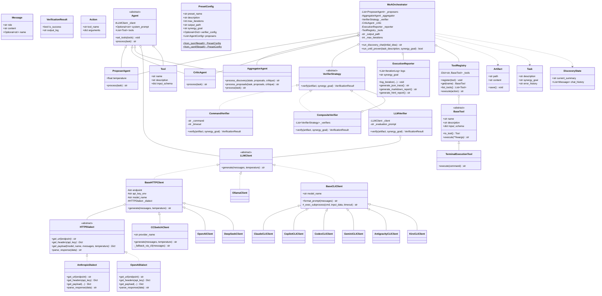

# 🚀 MoA Engine: Autonomous Mixture-of-Agents Framework with CC Switch & Deterministic Verification

[](https://github.com/NickScherbakov/moa-cc-switch/actions/workflows/ci.yml)
[](https://www.python.org/downloads/)
[](#-architectural-principles-solid)
[](LICENSE)

**moa-cc-switch** is an autonomous cognitive framework built on the **Mixture-of-Agents (MoA)** architecture in Python 3.10+. Designed to solve complex software engineering, architectural, and analytical tasks, it unites diverse Large Language Model (LLM) providers—spanning HTTP APIs (Anthropic Claude, OpenAI GPT, DeepSeek, Ollama) and local CLI tools (Claude CLI, Copilot CLI, Codex CLI, Gemini CLI, Antigravity CLI, Kiro CLI)—into a synergistic, self-correcting cognitive swarm.

The framework closes the **OODA Loop** (Observe, Orient, Decide, Act) by orchestrating multi-agent collaboration with automated routing through **CC Switch**, interactive human-in-the-loop requirement discovery, multi-context web scraping, tool execution (Action Layer), and **deterministic multi-layered verification**.

---

## 🧠 Key Capabilities & Architecture

### 1. Synergy Goal Alignment (`synergy_goal`)
Agents are freed from blind instruction following. The engine separates the immediate local task (`task.description`) from the strategic overarching intent (`task.synergy_goal`). All participants in the swarm—including an independent LLM judge—receive the strategic objective, ensuring the swarm discards solutions that are formally correct but miss the high-level business goal.

### 2. Action Layer & Tool Execution (`ToolRegistry`)
The swarm possesses operational tools. The integrated `ToolRegistry` empowers the `AggregatorAgent` to issue structured actions alongside code generation. The default `TerminalExecutionTool` enables agents to:
- Execute shell scripts, run test suites (`pytest`), and trigger `curl` requests asynchronously.
- Read runtime `stdout` and `stderr` output logs.
- Analyze runtime errors and enter self-correction loops with full context on why previous iterations failed.

### 3. Interactive Discovery Phase (Discovery Chat / `-i`)
Turns the terminal into a collaborative design environment before execution. The swarm interviews the user to refine ambiguity:
- **Proposers** generate ideas and uncover logical gaps in requirements.
- **Critic** highlights potential bugs, edge cases, and security concerns.
- **Aggregator** applies **Rolling Summary** (continuous context compression) to update requirements without exceeding context window limits.

### 4. Deterministic Multi-Layer Verification (`verifiers`)
Artifacts are not deemed successful until proven through empirical verification:
- `CommandVerifier`: Hard deterministic verification running test suites (`pytest`), linters, or custom shell commands via `shlex.split`.
- `LLMVerifier`: Semantic evaluation by an independent LLM judge assessing whether the generated artifact satisfies the `synergy_goal`.
- `CompositeVerifier`: Sequential chain of verifiers that short-circuits on the first failure.

### 5. CC Switch & Hybrid Provider Strategy
- **HTTP Transport Strategy (`HTTPDialect`)**: Decouples API protocol details (`AnthropicDialect`, `OpenAIDialect`) while reusing `httpx.AsyncClient` connection pools with exponential backoff retries.
- **Safe Subprocess Execution (`BaseCLIClient`)**: Eliminates system vulnerabilities by passing prompts through `stdin` (`input_data`) instead of command-line arguments, avoiding shell injection risks (`shell=False`) and bypassing `ARG_MAX` length limits.
- **Smart CC Switch Routing (`CCSwitchClient`)**: Automatically attempts HTTP API delivery and falls back gracefully to the local `cc-switch` CLI utility if the network or API key is unavailable.

### 6. Multi-Context Web Scraping (`--context-url`)
Asynchronously fetches documentation or external websites via `httpx`, automatically stripping non-content HTML elements (`script`, `style`, `noscript`, `meta`, `head`) with `BeautifulSoup4` to inject clean text into the task context.

### 7. Full Observability & Trace Generation (`ExecutionReporter`)
Every thought process, agent proposal, critique, tool invocation, and verification log is fully digitized. The `ExecutionReporter` automatically generates comprehensive execution reports upon completion:
- **HTML Report** (`moa_report.html`): Interactive visual dashboard.
- **Markdown Summary** (`moa_report.md`): Clean summary for documentation and CI logs.
- **JSON Trace** (`moa_trace.json`): Structured machine-readable trace file.

### 8. Declarative Preset System (`presets`)
Engine runs can be configured declaratively via JSON or YAML files (`presets/infolimp-audit.json`), specifying roles, providers, models, system prompts, goals, and verifiers.

---

## 🤖 Supported LLM Providers

| Provider Key | Client Class | Base Class | Invocation Method | Default Model |
|---|---|---|---|---|
| `anthropic`, `ccswitch` | `CCSwitchClient` | `BaseHTTPClient` | HTTP API (`AnthropicDialect`) + `cc-switch` CLI fallback | `claude-3-5-haiku-20241022` |
| `openai` | `OpenAIClient` | `BaseHTTPClient` | HTTP API (`OpenAIDialect`) | `gpt-4o-mini` |
| `deepseek` | `DeepSeekClient` | `BaseHTTPClient` | HTTP API (`OpenAIDialect`) | `deepseek-coder` |
| `ollama` | `OllamaClient` | `LLMClient` | Local HTTP REST (`localhost:11434`) | `qwen2.5-coder` |
| `claude`, `claude-cli` | `ClaudeCLIClient` | `BaseCLIClient` | `claude --print --model <model>` via `stdin` | `haiku` |
| `copilot`, `copilot-cli` | `CopilotCLIClient` | `BaseCLIClient` | `copilot --silent --yolo` via `stdin` | `default` |
| `codex`, `codex-cli` | `CodexCLIClient` | `BaseCLIClient` | `codex exec -` via `stdin` | `default` |
| `gemini`, `gemini-cli` | `GeminiCLIClient` | `BaseCLIClient` | `gemini` via `stdin` | `default` |
| `antigravity`, `agy` | `AntigravityCLIClient` | `BaseCLIClient` | `agy --dangerously-skip-permissions` via `stdin` | `default` |
| `kiro`, `kiro-cli` | `KiroCLIClient` | `BaseCLIClient` | `kiro chat -m ask` + fallback to Codex/Claude | `default` |

---

## 📐 Class Diagram


```mermaid
classDiagram
    class Message {
        +str role
        +str content
        +Optional~str~ name
    }
    class Task {
        +str description
        +str synergy_goal
        +str error_history
    }
    class VerificationResult {
        +bool is_success
        +str output_log
    }
    class Artifact {
        +str path
        +str content
        +save() void
    }
    class DiscoveryState {
        +str current_summary
        +List~Message~ chat_history
    }
    class Tool {
        +str name
        +str description
        +dict input_schema
    }
    class Action {
        +str tool_name
        +dict arguments
    }

    class LLMClient {
        <<abstract>>
        +generate(messages, temperature)* str
    }

    class HTTPDialect {
        <<abstract>>
        +get_url(endpoint)* str
        +get_headers(api_key)* Dict
        +get_payload(model_name, messages, temperature)* Dict
        +parse_response(data)* str
    }
    class AnthropicDialect {
        +get_url(endpoint) str
        +get_headers(api_key) Dict
        +get_payload(...) Dict
        +parse_response(data) str
    }
    class OpenAIDialect {
        +get_url(endpoint) str
        +get_headers(api_key) Dict
        +get_payload(...) Dict
        +parse_response(data) str
    }
    HTTPDialect <|.. AnthropicDialect
    HTTPDialect <|.. OpenAIDialect

    class BaseHTTPClient {
        #str endpoint
        #str api_key_env
        #str model_name
        #HTTPDialect _dialect
        +generate(messages, temperature) str
    }
    LLMClient <|.. BaseHTTPClient
    BaseHTTPClient o-- HTTPDialect

    class CCSwitchClient {
        +str provider_name
        +generate(messages, temperature) str
        -_fallback_via_cli(messages) str
    }
    class OpenAIClient
    class DeepSeekClient
    class OllamaClient
    BaseHTTPClient <|-- CCSwitchClient
    BaseHTTPClient <|-- OpenAIClient
    BaseHTTPClient <|-- DeepSeekClient
    LLMClient <|.. OllamaClient

    class BaseCLIClient {
        +str model_name
        +format_prompt(messages) str
        #_exec_subprocess(cmd, input_data, timeout) str
    }
    LLMClient <|.. BaseCLIClient

    class ClaudeCLIClient
    class CopilotCLIClient
    class CodexCLIClient
    class GeminiCLIClient
    class AntigravityCLIClient
    class KiroCLIClient
    BaseCLIClient <|-- ClaudeCLIClient
    BaseCLIClient <|-- CopilotCLIClient
    BaseCLIClient <|-- CodexCLIClient
    BaseCLIClient <|-- GeminiCLIClient
    BaseCLIClient <|-- AntigravityCLIClient
    BaseCLIClient <|-- KiroCLIClient

    class Agent {
        <<abstract>>
        #LLMClient _client
        +Optional~str~ system_prompt
        +List~Tool~ tools
        +set_tools(tools) void
        +process(task)* str
    }
    class ProposerAgent {
        +float temperature
        +process(task) str
    }
    class CriticAgent {
        +process(task) str
    }
    class AggregatorAgent {
        +process_discovery(state, proposals, critique) str
        +process_proposals(task, proposals, critique) str
        +process(task) str
    }
    Agent <|-- ProposerAgent
    Agent <|-- CriticAgent
    Agent <|-- AggregatorAgent
    Agent o-- LLMClient
    Agent o-- Tool

    class BaseTool {
        <<abstract>>
        +str name*
        +str description*
        +dict input_schema*
        +to_tool() Tool
        +execute(**kwargs)* str
    }
    class TerminalExecutionTool {
        +execute(command) str
    }
    class ToolRegistry {
        -Dict~str, BaseTool~ _tools
        +register(tool) void
        +get(name) BaseTool
        +list_tools() List~Tool~
        +execute(action) str
    }
    BaseTool <|-- TerminalExecutionTool
    ToolRegistry o-- BaseTool

    class VerifierStrategy {
        <<abstract>>
        +verify(artifact, synergy_goal)* VerificationResult
    }
    class CommandVerifier {
        -str _command
        -int _timeout
        +verify(artifact, synergy_goal) VerificationResult
    }
    class CompositeVerifier {
        -List~VerifierStrategy~ _verifiers
        +verify(artifact, synergy_goal) VerificationResult
    }
    class LLMVerifier {
        -LLMClient _client
        -str _evaluation_prompt
        +verify(artifact, synergy_goal) VerificationResult
    }
    VerifierStrategy <|.. CommandVerifier
    VerifierStrategy <|.. CompositeVerifier
    VerifierStrategy <|.. LLMVerifier
    CompositeVerifier o-- VerifierStrategy
    LLMVerifier o-- LLMClient

    class ExecutionReporter {
        +List~IterationLog~ logs
        +str synergy_goal
        +log_iteration(...) void
        +generate_json_trace() str
        +generate_markdown_report() str
        +generate_html_report() str
    }

    class PresetConfig {
        +str preset_name
        +str description
        +int max_iterations
        +str output_path
        +str synergy_goal
        +Optional~Dict~ verifier_config
        +List~AgentConfig~ proposers
        +from_json(filepath)$ PresetConfig
        +from_yaml(filepath)$ PresetConfig
    }

    class MoAOrchestrator {
        -List~ProposerAgent~ _proposers
        -AggregatorAgent _aggregator
        -VerifierStrategy _verifier
        -CriticAgent _critic
        -ExecutionReporter _reporter
        -ToolRegistry _tools
        -str _output_path
        -int _max_iterations
        +run_discovery_chat(initial_idea) str
        +run_until_proven(task_description, synergy_goal) bool
    }

    MoAOrchestrator o-- ProposerAgent
    MoAOrchestrator o-- AggregatorAgent
    MoAOrchestrator o-- CriticAgent
    MoAOrchestrator o-- VerifierStrategy
    MoAOrchestrator o-- ExecutionReporter
    MoAOrchestrator o-- ToolRegistry
    MoAOrchestrator ..> Artifact
    MoAOrchestrator ..> Task
    MoAOrchestrator ..> DiscoveryState
```

---

## 🏛 Architectural Principles (SOLID)

- **Single Responsibility Principle (SRP)**:
  - `HTTPDialect`: Encapsulates provider-specific HTTP headers, URLs, and JSON formats.
  - `BaseHTTPClient`: Handles HTTP transport, status checking, and retry backoff.
  - `BaseCLIClient`: Manages process isolation, prompt formatting, and safe subprocess invocation.
  - `Agent` subclasses (`ProposerAgent`, `CriticAgent`, `AggregatorAgent`): Focus strictly on their swarm roles.
  - `VerifierStrategy` implementations: Handle deterministic code or semantic LLM verification.
  - `ToolRegistry` & `TerminalExecutionTool`: Handle tool registration and shell command execution.
  - `MoAOrchestrator`: Controls iteration loops, multi-agent aggregation, and self-correction.
  - `ExecutionReporter`: Formats and exports trace logs (HTML, Markdown, JSON).
- **Open/Closed Principle (OCP)**: Adding new HTTP dialects (`HTTPDialect`), CLI tools (`BaseCLIClient`), tools (`BaseTool`), or verification strategies (`VerifierStrategy`) requires no changes to core orchestration logic.
- **Liskov Substitution Principle (LSP)**: Any `LLMClient` implementation (HTTP or CLI) or `VerifierStrategy` can be substituted seamlessly across agents or verifiers.
- **Interface Segregation Principle (ISP)**: Clean separation of domain models (`Message`, `Task`, `Artifact`, `VerificationResult`, `Tool`, `Action`, `DiscoveryState`).
- **Dependency Inversion Principle (DIP)**: `MoAOrchestrator`, `Agent`, and `LLMVerifier` depend on abstractions (`LLMClient`, `VerifierStrategy`, `BaseTool`), not concrete implementations.

---

## 🛠 Installation & Setup

### 1. Requirements
- **Python 3.10+**

### 2. Clone and Install
```bash
git clone https://github.com/NickScherbakov/moa-cc-switch.git
cd moa-cc-switch

# Install package in editable mode with development dependencies
pip install -e .[dev]
```

### 3. Environment Configuration (`.env`)
Create a `.env` file in the project root directory (optional, needed for HTTP API access):

```env
ANTHROPIC_API_KEY=sk-ant-api03-...
OPENAI_API_KEY=sk-proj-...
DEEPSEEK_API_KEY=sk-...

# Global Engine Settings
CC_SWITCH_ENDPOINT=https://api.anthropic.com
MOA_TIMEOUT=120.0
MOA_MAX_RETRIES=3
MOA_RETRY_BACKOFF=1.5
```

---

## 🚀 Usage (CLI & Examples)

The framework provides the unified `moa-run` CLI command.

### 1. Autonomous Execution Mode
Executes the agent swarm iteratively until the verifier confirms that the code passes all tests and satisfies the synergy goal:

```bash
moa-run \
  --task "Write a thread-safe LRU Cache in Python" \
  --goal "Code must be production-ready, fully typed, and optimized for O(1) operations" \
  --verify "pytest tests/test_lru_cache.py" \
  --out "lru_cache.py"
```

### 2. Preset-Driven Execution Mode
Run complex multi-agent configurations defined in JSON or YAML preset files:

```bash
moa-run --preset presets/infolimp-audit.json
```

### 3. Web Context Scraping Mode (`--context-url`)
Fetch and inject clean context from one or more external websites into the task description:

```bash
moa-run \
  --preset presets/infolimp-audit.json \
  --context-url https://infolimp.ru https://nopikreport.com https://nopikreport.store
```

### 4. Interactive Discovery Mode (`-i` / `--interactive`)
Starts an interactive terminal chat session with the swarm before code generation. The agents interview the user, compress requirements via **Rolling Summary**, and begin generation when `/execute` is entered:

```bash
moa-run -i --task "Design a resilient RAG pipeline architecture" --preset presets/infolimp-audit.json
```

### 5. Running Automated Tests
```bash
pytest
```

---

## 👥 Authors & Contributors

| Role | Contributor | Contributions |
|---|---|---|
| Lead Architect & Author | [NickScherbakov](https://github.com/NickScherbakov) | MoA Engine Core Architecture, CC Switch Integration, HTTP Transport & Dialects, CLI Drivers, Action Layer & Tool Registry, Multi-Context Scraping, Verification Strategies |
| Co-Author | [Kiro](https://kiro.dev) (AI Assistant) | Specification & implementation of `KiroCLIClient`, `BaseHTTPClient` / `BaseCLIClient` refactoring, documentation revision |

---

## 📜 License

This project is licensed under the [MIT License](LICENSE).
